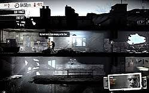

# Визуальные ориентиры

This War of Mine, 11 bit studios: https://11bitstudios.com/games/this-war-of-mine/

Скриншоты: https://steamcommunity.com/app/282070/screenshots/

Официальная галерея: https://11bitstudios.com/wp-content/uploads/2021/02/11.png и https://11bitstudios.com/wp-content/uploads/2021/02/10.png

Дата изучения: 13 сентября 2026.

Для прототипа взяты пространственные принципы: дом в разрезе, несколько этажей, читаемые лестничные связи, ограниченный обзор, комнаты с закрытыми дверями и компактные значки взаимодействия. Графика создаётся отдельно; изображения игры не включаются в игровой билд. Лор предыдущего beat ’em up, офисные зоны, лифты и суперкомбинации не используются.

Новые ассеты создаются встроенным imagegen, промпты — asset-prompts.json. Единственный сохранённый герой — разработчик из прежних атласов.

## Свет и чёрные срезы — уточнение от 14 сентября 2026

Пользователь предоставил этот скриншот как ориентир света и разреза. Взяты чёрные силуэты срезанных конструкций и грунта, локальные светлые полосы от окон, мягкое затухание и контраст с тёмным интерьером. Реализация выполнена средствами Canvas; скриншот хранится только в документации и не используется игровым рендером.
