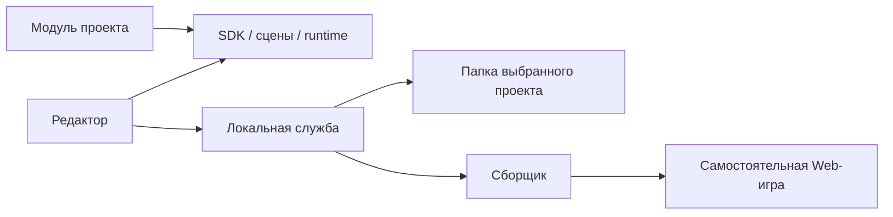

# Shelter Engine SDK 1

## Границы

`src/engine/` содержит документ сцены, команды, историю, загрузчик ресурсов, общий Three.js renderer, runtime и публичные контракты. `src/editor/` использует только эти контракты и подключённые модули. `src/modules/` содержит переиспользуемые компоненты и метрическую 2.5D-планировку. `scripts/engine/` реализует локальное хранение, импорт, архивы, проверку и сборку.

Код While the light is on находится в `games/while-the-light-is-on/scripts/`, её ресурсы — в `assets/`. Файлы `src/base/*.ts` оставлены как совместимые реэкспорты для существующих проверок и сторонних ссылок. Редактор и ядро их не импортируют. `ThreeRenderer` игры расширяет общий `SceneRenderer`; документы и команды общие, параллельный формат сцены не вводился.



## Файлы проекта

Манифест `project.shelter.json`: `format: shelter-project`, `version: 1`, `sdk: 1`, `projectId`, `name`, `gameVersion`, `startScene`, `scenes`, `assets`, `modules`, `build`. Сцены ссылаются на ресурсы стабильными ID, реестр ресурсов — путями относительно проекта. Абсолютные пути и временные object URL не являются игровыми ссылками.

`scenes/` хранит читаемые JSON-документы, `assets/` — бинарные оригиналы, `scripts/` — код проекта, `prefabs/` — проектные заготовки, `settings/` — локальные настройки и восстанавливаемые резервные версии. Производные входы сборки хранятся вне проекта в `.shelter-cache/builds/`; финальные результаты находятся в выбранной отдельной папке.

Сохранение валидирует снимок, записывает неизменяемые версии сцен и переключает манифест одним атомарным переименованием. Перед переключением сохраняется предыдущий снимок. Хэш ревизии предотвращает незаметную перезапись внешних изменений. Неизвестные версии и отсутствующие обязательные ссылки дают ошибку.

Документ сцены поддерживает v1 и v2. В v2 добавлены идентичность, активная камера и данные модулей. Валидация ядра не требует конкретного шаблона, героя или здания. Копирование проекта меняет `projectId` и `build.appId`, перенос сохраняет их. Ключи хранения имеют форму `shelter:<projectId>:<scope>:<sceneId или appId>`.

## Проектный модуль

Манифест явно объявляет runtime и необязательный editor entry внутри `scripts/`. Runtime экспортирует типизированный `EngineModule` SDK 1. Модуль не должен обращаться к DOM или создавать GPU/аудио-ресурсы при импорте: это выполняется в управляемом сеансе. Сборщик импортирует декларации в проверяющем окружении и проверяет совместимость схем до выпуска игры.

```ts
import type {EngineModule} from '@shelter/sdk.ts';

const module: EngineModule = {
  id: 'my-game',
  sdk: 1,
  components: [{
    id: 'my-game.turn',
    name: 'Вращение декорации',
    fields: [{name: 'speed', label: 'Скорость', type: 'number',
      default: 20, min: -180, max: 180, unit: '°/с'}],
    update({runtime, node, component}, dt) {
      const object = runtime.instances.get(node.id)!.root;
      object.rotation.y += Number(component.values.speed) * Math.PI / 180 * dt;
    }
  }]
};
export default module;
```

Поля схем поддерживают числа с диапазонами, строки, переключатели, перечисления и связи с объектами, ресурсами, сценами. Инспектор выводит пользовательские названия; связи выбираются из списков. Компоненты имеют `load`, `update`, `pause`, `dispose`. `validateScene` задаёт дополнительные ограничения проекта.

Для собственной игры модуль может реализовать `createSession(SessionOptions) → RuntimeSession`. Параметры передают контейнер, зафиксированный проект, стартовую сцену, реестр, resolver ресурсов и политику прогресса. Сеанс реализует `pause` и `dispose`. В While the light is on этот адаптер запускает существующий мир и UI. У редакторского entry `prepare(assetUrl, scene)` возвращает фабрику `EditorHost`; её `draw`, `updateCamera`, `dispose` связывают сцену с модулем. Интерфейс `supportedComponents` ограничивает список предлагаемых поведений фактическими возможностями сеанса.

Пробная игра создаётся в отдельном iframe. Сообщения принимаются только от ожидаемого окна и origin. Остановка освобождает слушателя родителя и уничтожает игровой контекст. Авторский renderer приостанавливается; его камера, история и выделение сохраняются. Обычный прогресс не читается и не записывается при `savePolicy: isolated`.

## Планировка

`Layout` содержит комнаты в метрах, этажи, двери, лестницы, проёмы и появление. `layoutIssues`, `wallCrossing`, `visibleRooms` и `LayoutView` используют одни записи. Декоративная GLB-модель не становится препятствием автоматически. Задний проём не открывает проход в перегородке.

Нейтральный runtime использует простую комнатную модель видимости предметов и реальные тени геометрии. Более подробные лучи обзора, оконный свет, память комнат, повреждения и поведение двери у ручки принадлежат модулю исходной игры. Это осознанно разные игровые правила при общей семантической планировке.

Адаптер `layout-adapter.ts` преобразует прежние единицы дома (80 единиц на метр, смещение X 1000) в метрические данные. После изменения валидной планировки он пересоздаёт архитектуру и переносит сохранившиеся свойства объектов. Невалидную незавершённую планировку можно хранить, но запуск и сборка блокируются.

## Ресурсы

`AssetRecord` хранит ID/версию, путь, зависимости, размер, тип, происхождение, лицензию, теги и характеристики. glTF проверяется на поддерживаемые расширения, полноту локальных зависимостей и бюджеты до изменения реестра. Изображения проверяются до загрузки. Материалы связывают карты явно: Base Color в sRGB, остальные линейные. Два экземпляра могут делить геометрию и исходные материалы; переопределение клонирует материалы и нужные текстуры экземпляра.

При добавлении из библиотеки проект получает собственную копию выбранной версии с относительными путями. Другая версия добавляется отдельно. Модель экземпляра заменяется явным выбором в инспекторе и возвращается отменой. Фонового обновления оригиналов нет.

## Сборка и проверки

`ProjectStorage`, `ProjectSession`, `RuntimeSession`, `BuildService` объявлены в публичном SDK. HTTP API является реализацией локальной оболочки. Игровая точка входа получает снимок и resolver, а не путь к Node-службе.

Сборщик фиксирует файлы во временном каталоге, проверяет версии, стартовую сцену, компоненты, планировку, ресурсы, TypeScript-контракт модулей. Связанные сцены переходов включаются транзитивно. Неиспользуемые записи реестра не поставляются; проектный модуль явно объявляет динамические каталоги через `modules[].assets`. Это требуется игре дома, которая загружает атласы по собственным путям.

Vite собирает отдельный игровой entry. В результате нет менеджера, манипуляторов и editor entry модулей. Проверяется состав JS, затем публикуются новая папка, ZIP и `build-report.json`. Предыдущий успешный результат не перезаписывается. Сборки в папку исходников и в опасные родительские каталоги запрещены.

Разработческие команды:

- `npm test` — прежние проверки мира, обзора, освещения и редакторских команд.
- `npm run test:engine` — хранение, архивы, зависимости, отрицательные сборки и независимость от игры A.
- `npm run test:e2e` — 42 регрессионных сценария игры A и редактора, отдельный сервер на порту 5175.
- `npm run test:engine:e2e` — настоящие действия в Chrome через интерфейс.
- `npm run build` — проверка TypeScript и сборка приложения редактора.
- `npm run build:game -- <папка проекта>` — тот же игровой pipeline для CI.
- `npm run build:pages` — сборка отдельного проекта A с базой `/While-the-light-is-on/` в `dist/` для существующего workflow.
- `node tests/engine/standalone.mjs` — проверки копий двух готовых результатов обычным статическим сервером; ожидает результаты браузерной приёмки в `artifacts/engine/`.

`node tests/engine/lifecycle.mjs` проверяет сохранность документа, прогресса, число окон и GPU-ресурсов редактора после десяти пробных сеансов; требует редактор на порту 5174 и результаты сквозной приёмки.
